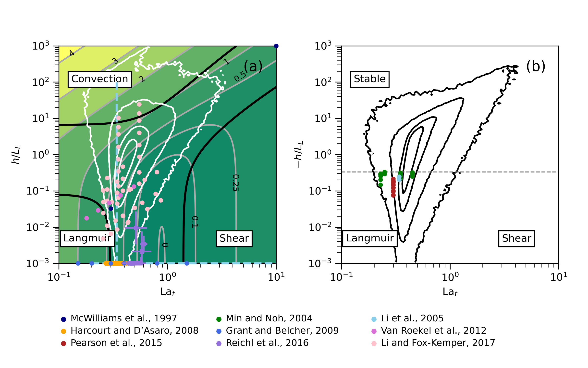

# Regime diagram

Use `LRF19_regime_diagram.ipynb` to reproduce Figure 1 of [Li et al., 2019](https://agupubs.onlinelibrary.wiley.com/doi/full/10.1029/2019MS001810). All required data can be found in `data/`.

See [here](https://github.com/qingli411/gotmwork) for more tools used in that paper.
